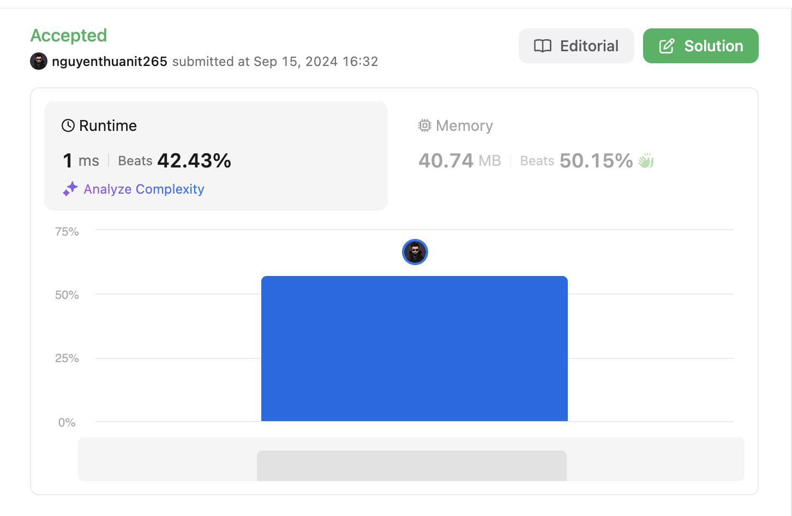

# Intuition
Số lũy thừa của 2 có đặc điểm là chỉ có một bit 1 trong biểu diễn nhị phân. Ví dụ: 1 (2^0), 2 (2^1), 4 (2^2), 8 (2^3), v.v. Ta có thể kiểm tra điều này bằng cách liên tục chia số cho 2 và kiểm tra tính chẵn lẻ trong quá trình.

# Approach
1. Kiểm tra các trường hợp đặc biệt:
    - Nếu n <= 0, không phải là lũy thừa của 2.
    - Nếu n là số lẻ và lớn hơn 1, không phải là lũy thừa của 2.
    - Nếu n = 1, là lũy thừa của 2 (2^0 = 1).
2. Lặp qua số n, liên tục chia cho 2:
    - Nếu gặp số lẻ trong quá trình chia, không phải là lũy thừa của 2.
    - Tiếp tục chia cho đến khi n = 0.
3. Nếu quá trình chia kết thúc mà không gặp số lẻ, đó là lũy thừa của 2.

# Complexity
- Time complexity: O(log n)
  <!-- Vòng lặp while chạy log_2(n) lần vì n được chia đôi trong mỗi lần lặp -->

- Space complexity: O(1)
  <!-- Chỉ sử dụng một số lượng cố định các biến, không phụ thuộc vào kích thước đầu vào -->

# Code
```java
class Solution {
    public boolean isPowerOfTwo(int n) {
        if (n <= 0) {
            return false;
        }
        if (n % 2 != 0 && n > 1) {
            return false;
        }
        if (n == 1) {
            return true;
        }
        while (n > 0) {
            if (n % 2 != 0 && n > 1) {
                return false;
            }
            n = n / 2;
        }
        return true;
    }
}
```
# Submission


# Link github

https://github.com/nguyenthuanit265/java-leetcode