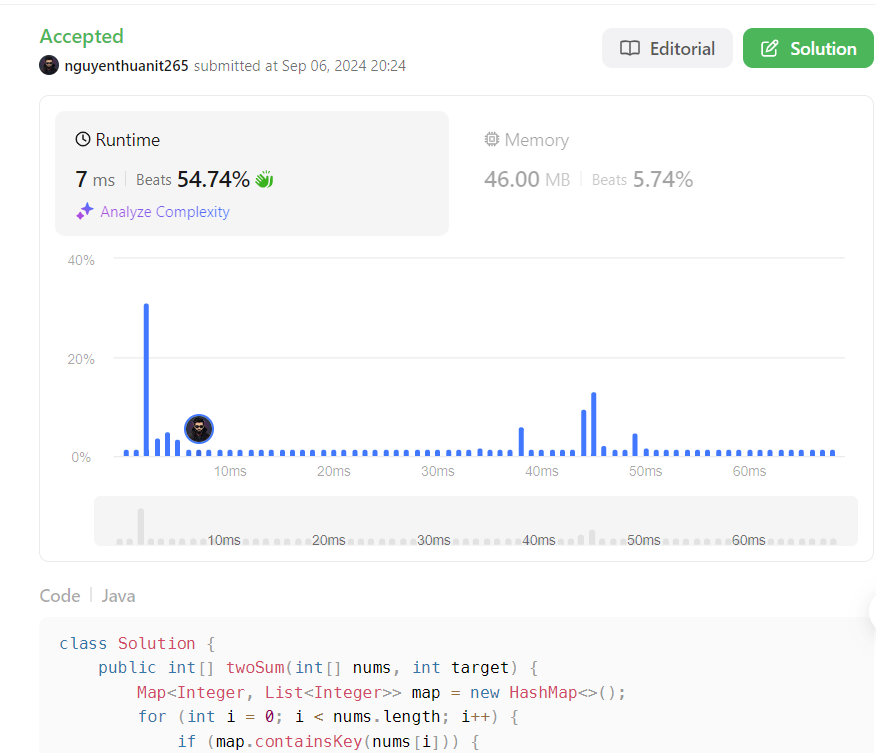

# Intuition

<!-- Describe your first thoughts on how to solve this problem. -->
Bài toán yêu cầu tìm hai số trong mảng có tổng bằng target. Sử dụng một cấu trúc dữ liệu như HashMap có thể giúp tăng
tốc quá trình tìm kiếm.

# Approach

<!-- Describe your approach to solving the problem. -->

1. Tạo một HashMap để lưu trữ giá trị của mỗi phần tử và danh sách các chỉ số của nó trong mảng.
2. Duyệt qua mảng lần đầu để xây dựng HashMap.
3. Duyệt qua mảng lần thứ hai, với mỗi phần tử, tìm kiếm (target - phần tử hiện tại) trong HashMap.
4. Nếu tìm thấy và chỉ số khác với chỉ số hiện tại, trả về cặp chỉ số này.
5. Nếu không tìm thấy cặp số nào thỏa mãn, trả về {-1, -1}.

# Complexity

- Time complexity:

<!-- Add your time complexity here, e.g. $$O(n)$$ -->
$$O(n)$$ - Chúng ta duyệt qua mảng hai lần, mỗi lần là O(n). Các thao tác trên HashMap (thêm, tìm kiếm) có độ phức tạp
trung bình là O(1).

- Space complexity:

<!-- Add your space complexity here, e.g. $$O(n)$$ -->
$$O(n)$$ - Trong trường hợp xấu nhất, HashMap sẽ lưu trữ tất cả các phần tử của mảng.

# Code

```java
class Solution {
    public int[] twoSum(int[] nums, int target) {
        Map<Integer, List<Integer>> map = new HashMap<>();
        for (int i = 0; i < nums.length; i++) {
            if (map.containsKey(nums[i])) {
                map.get(nums[i]).add(i);
            } else {
                List<Integer> list = new ArrayList<>();
                list.add(i);
                map.put(nums[i], list);
            }
        }

        for (int i = 0; i < nums.length; i++) {
            if (map.containsKey(target - nums[i])) {
                List<Integer> listIndex = map.get(target - nums[i]);
                for (int itemIndex : listIndex) {
                    if (itemIndex != i) {
                        return new int[]{i, itemIndex};
                    }
                }
            }
        }
        return new int[]{-1, -1};
    }
}
```

# Submission



# Link github

https://github.com/nguyenthuanit265/java-leetcode