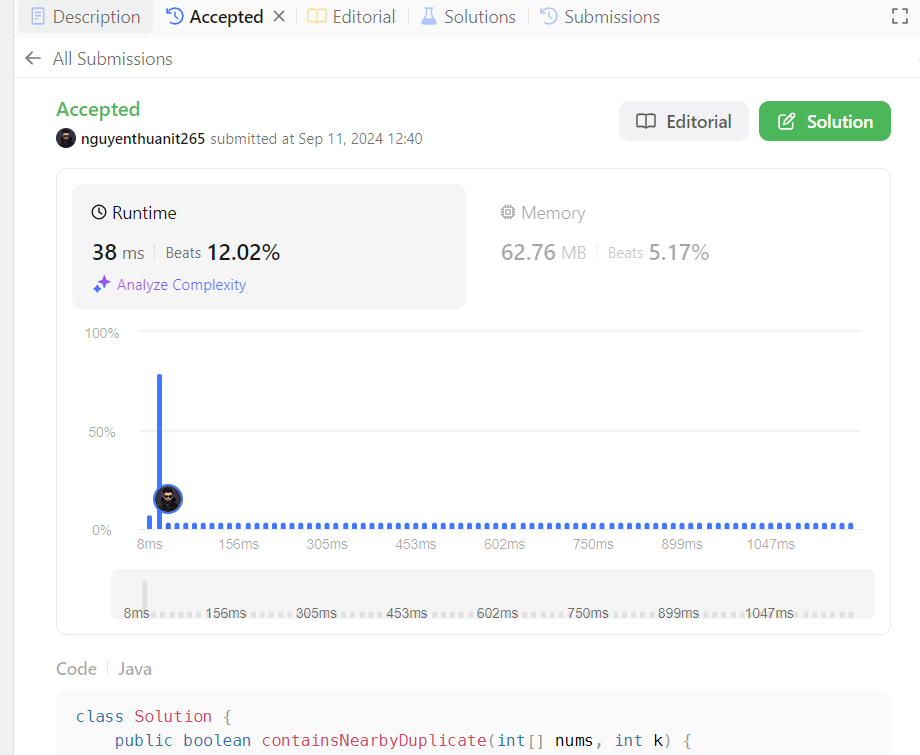

# Intuition

<!-- Describe your first thoughts on how to solve this problem. -->
Khi đọc đề bài, ý tưởng đầu tiên là sử dụng một cấu trúc dữ liệu để lưu trữ các chỉ số của mỗi số trong mảng. HashMap là
một lựa chọn tốt vì nó cho phép truy cập nhanh chóng.

# Approach

<!-- Describe your approach to solving the problem. -->

1. Tạo một HashMap với key là giá trị của phần tử trong mảng và value là một danh sách các chỉ số của phần tử đó.
2. Duyệt qua mảng input và cập nhật HashMap.
3. Sau khi đã xây dựng xong HashMap, duyệt qua từng entry trong HashMap.
4. Đối với mỗi entry, nếu danh sách các chỉ số có ít hơn 2 phần tử, bỏ qua.
5. Nếu có từ 2 phần tử trở lên, sử dụng hai con trỏ để kiểm tra khoảng cách giữa các chỉ số.
6. Nếu tìm thấy hai chỉ số có khoảng cách không quá k, trả về true.
7. Nếu không tìm thấy cặp chỉ số nào thỏa mãn, trả về false.

# Complexity

- Time complexity: $$O(n)$$

<!-- Add your time complexity here, e.g. $$O(n)$$ -->
Trong trường hợp xấu nhất, chúng ta phải duyệt qua toàn bộ mảng một lần để xây dựng HashMap, và sau đó duyệt qua tất cả
các phần tử một lần nữa khi kiểm tra khoảng cách. Tuy nhiên, mỗi phần tử chỉ được xét tối đa hai lần, nên độ phức tạp
vẫn là O(n).

- Space complexity: $$O(n)$$

<!-- Add your space complexity here, e.g. $$O(n)$$ -->
Trong trường hợp xấu nhất, khi tất cả các phần tử trong mảng đều khác nhau, HashMap sẽ chứa n entry, mỗi entry có một
danh sách chỉ số chứa một phần tử. Do đó, độ phức tạp không gian là O(n).

# Code

```java
class Solution {
    public boolean containsNearbyDuplicate(int[] nums, int k) {
        Map<Integer, List<Integer>> map = new HashMap<>();
        for (int i = 0; i < nums.length; i++) {
            if (map.containsKey(nums[i])) {
                map.get(nums[i]).add(i);
            } else {
                List<Integer> list = new ArrayList<>();
                list.add(i);
                map.put(nums[i], list);
            }
        }
        for (Map.Entry<Integer, List<Integer>> entry : map.entrySet()) {
            List<Integer> list = entry.getValue();
            if (list.size() < 2) {
                continue;
            }
            int cur = 0, next = 1;
            while (next < list.size()) {
                if (list.get(next) - list.get(cur) <= k) {
                    return true;
                } else {
                    cur++;
                    next++;
                }
            }
        }
        return false;
    }
}
```

## Submission



# Link github

https://github.com/nguyenthuanit265/java-leetcode