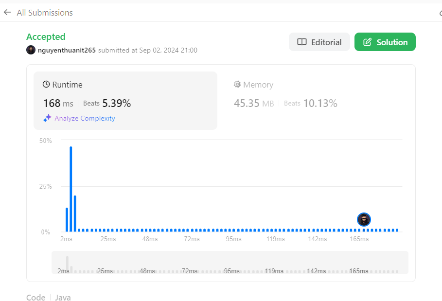

## Intuition

<!-- Describe your first thoughts on how to solve this problem. -->
Bài toán yêu cầu chúng ta tìm độ dài của chuỗi con dài nhất mà không có ký tự lặp lại. Cách tiếp cận sử dụng cửa sổ
trượt (sliding window) là phù hợp ở đây, vì chúng ta có thể mở rộng cửa sổ khi gặp ký tự mới và thu hẹp nó khi tìm thấy
ký tự lặp lại.

## Approach

<!-- Describe your approach to solving the problem. -->

1. Khởi tạo:
    - Tạo một StringBuilder có tên `window` để lưu trữ chuỗi con hiện tại.
    - Khởi tạo biến `ans` để lưu độ dài chuỗi con dài nhất, ban đầu là 0.
    - Sử dụng hai con trỏ: `left` và `right`, cả hai đều bắt đầu từ vị trí 0.

2. Duyệt qua chuỗi:
    - Sử dụng vòng lặp while với điều kiện `right < s.length()`.

3. Xử lý ký tự tại vị trí `right`:
    - Kiểm tra xem ký tự hiện tại có trong `window` hay không bằng cách sử dụng
      `window.indexOf(String.valueOf(s.charAt(right)))`.

4. Nếu ký tự chưa có trong `window`:
    - Cập nhật `ans` bằng giá trị lớn hơn giữa `ans` hiện tại và độ dài cửa sổ mới (`right - left + 1`).
    - Thêm ký tự hiện tại vào cuối `window`.
    - Tăng `right` lên 1 để xét ký tự tiếp theo.

5. Nếu ký tự đã có trong `window`:
    - Reset `window` bằng cách tạo mới một StringBuilder rỗng.
    - Tăng `left` lên 1 để bắt đầu xét từ vị trí tiếp theo.
    - Đặt `right` bằng `left` để bắt đầu một cửa sổ mới.

6. Lặp lại bước 3-5 cho đến khi duyệt hết chuỗi.

7. Kết thúc: Trả về giá trị `ans`, là độ dài của chuỗi con dài nhất không có ký tự lặp lại.

## Complexity

<!-- Add your time complexity here, e.g. $$O(n)$$ -->

- Time complexity: O(n^2)
  Trong trường hợp xấu nhất, với mỗi ký tự (n), chúng ta có thể cần kiểm tra xem nó có tồn tại trong cửa sổ hay không (
  tối đa n ký tự), dẫn đến O(n^2).
  Phương thức `indexOf` của StringBuilder có độ phức tạp O(n) trong trường hợp xấu nhất.

<!-- Add your space complexity here, e.g. $$O(n)$$ -->

- Space complexity: O(min(m, n))
  Trong đó m là kích thước của bộ ký tự và n là độ dài của chuỗi.
  Trong trường hợp xấu nhất, StringBuilder `window` có thể lưu trữ tối đa min(m, n) ký tự.

## Code

```java
class Solution {
    public int lengthOfLongestSubstring(String s) {
        StringBuilder window = new StringBuilder();
        int ans = 0, left = 0, right = 0;

        while (right < s.length()) {
            if (window.indexOf(String.valueOf(s.charAt(right))) < 0) {
                ans = Math.max(ans, right - left + 1);
                window.append(s.charAt(right));
                right++;
            } else {
                window = new StringBuilder();
                left++;
                right = left;
            }
        }

        return ans;
    }
}
```

## Submission



## Solution 2

- Thay vì sử dụng StringBuilder và phương thức indexOf, -> có thể sử dụng HashSet để có thời gian tra cứu O(1).
- Tối ưu hóa việc thu hẹp cửa sổ bằng cách di chuyển con trỏ left đến vị trí sau ký tự lặp lại, thay vì tăng lên 1.

# Link github

https://github.com/nguyenthuanit265/java-leetcode